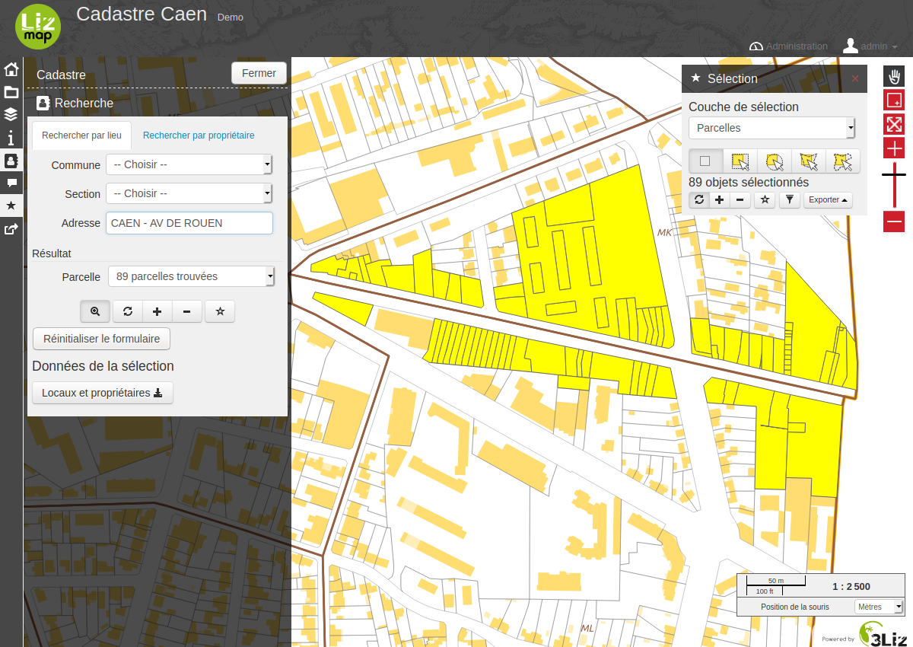

## Module Cadastre

Le module cadastre permet l'interrogation des données cadastrales MAJIC/EDIGEO au sein de [Lizmap Web Client](https://github.com/3liz/lizmap-web-client).



### Installation

Une fois que Lizmap Web Client est installé et fonctionnel, vous pouvez installer le module cadastre:

* Installer l'extension QGIS [Cadastre](https://github.com/3liz/QgisCadastrePlugin) sur le serveur dans un dossier nommé `cadastre`.
* Configurer le projet avec cette extension, notamment les variables dans le projet.
* Télécharger l'archive ZIP de la dernière version sur GitHub dans la page des releases.
* Extraire l'archive et copier le répertoire `cadastre` dans le répertoire `lizmap/lizmap-modules/` de l'application Lizmap Web Client
* Éditer le fichier `lizmap/var/config/localconfig.ini.php` et modifier la section `[modules]` en ajoutant la ligne `cadastre.access=2` sous la section:

```ini
[modules]
cadastre.access=2
```

* Installer le module à l'aide des scripts Lizmap:

```bash
php lizmap/install/installer.php
lizmap/install/clean_vartmp.sh
lizmap/install/set_rights.sh
```

Une fois l'installation effectuée, vous devez configurer les droits d'accès à l'outil via l'interface d'administration. Le module a créé:

* un groupe d'utilisateurs `Cadastre Lizmap` (identifiant `cadastre_lizmap`)
* 2 sujets de droit : `Accéder aux données de propriétaires` et `Utiliser le panneau de recherche`

Vous pouvez mettre certains utilisateurs dans ce groupe `Cadastre Lizmap`. Ils auront alors accès au panneau de recherche par localisation **ET** par nom de propriétaires. **Vous devez bien faire attention de n'accorder le droit `Accéder aux données de propriétaires` qu'aux personnes habititées !**.

Vous pouvez modifier plus finement les droits via le bouton `Changer les droits des groupes` situés dans le menu `Groupes d'utilisateurs pour les droits` de l'interface d'administration de Lizmap Web Client. *Attention, cette page modifie fortement les droits par défaut des groupes d'utilisateurs. Nous conseillons de ne pas touchez aux droits liés à Lizmap ici, sauf si vous maîtrisez ce que vous faites.*
