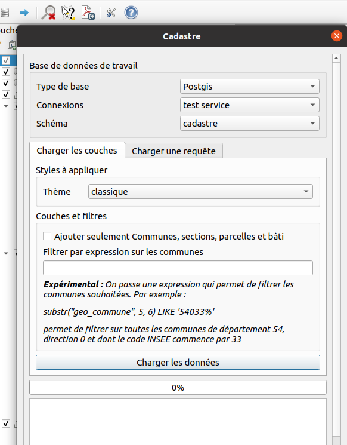
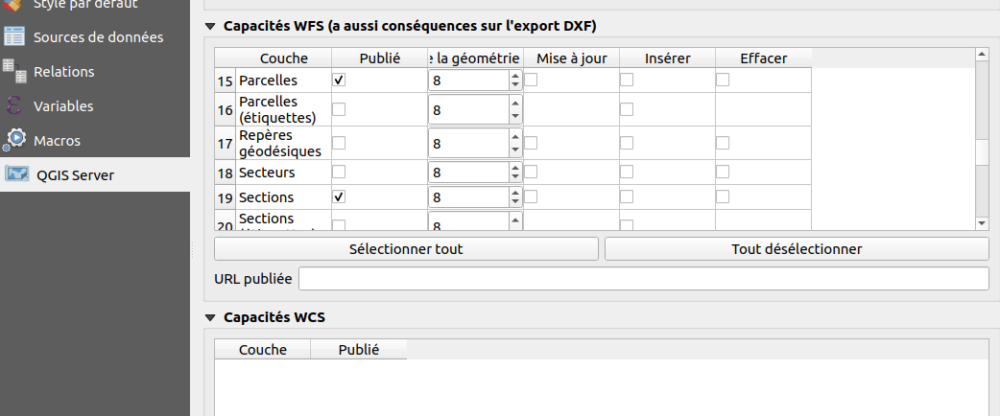
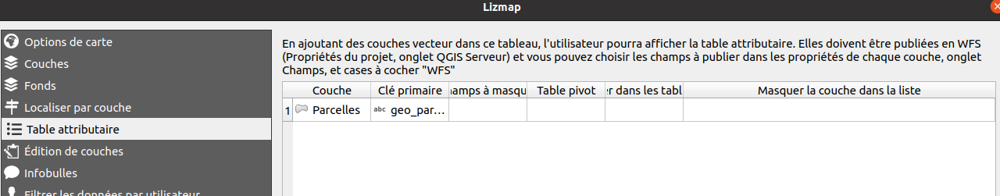

# Module Cadastre

Le module cadastre permet l'interrogation des données cadastrales MAJIC/EDIGEO au sein de [Lizmap Web Client](https://github.com/3liz/lizmap-web-client).


## Installation du module

Une fois que Lizmap Web Client est installé et fonctionnel, vous pouvez installer le module cadastre.

Depuis la version 1.5.2 du module, il est souhaitable de l'installer avec [Composer](https://getcomposer.org),
le système de paquet pour PHP. Si vous ne pouvez pas, ou si vous utilisez
lizmap 3.3 ou inférieur, passez à la section sur l'installation manuelle.

### Installation automatique avec Composer et lizmap 3.4 ou plus

* dans `lizmap/my-packages`, créer le fichier `composer.json` s'il n'existe pas
  déjà, en copiant le fichier `composer.json.dist`, qui s'y trouve.
* en ligne de commande, dans le répertoire `lizmap/my-packages/`, tapez :
  `composer require "lizmap/lizmap-cadastre-module"`
* puis dans le répertoire `lizmap/install/`, lancer les commandes suivantes :

```bash
php installer.php
clean_vartmp.sh
set_rights.sh
```

### Installation manuelle dans lizmap 3.3 ou 3.4 sans Composer

* Télécharger l'archive ZIP de la dernière version du module cadastre dans [la page des releases de Github](https://github.com/3liz/lizmap-cadastre-module/releases).
* Extraire l'archive et copier le répertoire `cadastre` dans le répertoire `lizmap/lizmap-modules/` de l'application Lizmap Web Client.
* Éditer le fichier `lizmap/var/config/localconfig.ini.php` et modifier la section `[modules]` en ajoutant la ligne `cadastre.access=2` sous la section:

```ini
[modules]
cadastre.access=2
```

* puis dans le répertoire `lizmap/install/`, lancer les commandes suivantes :

```bash
php installer.php
clean_vartmp.sh
set_rights.sh
```

## Configuration d'un projet QGIS

Pour utiliser le module cadastre dans lizmap il vous faut configurer un projet QGIS:

* Vous aurez besoin de l'extension QGIS [Cadastre](https://github.com/3liz/QgisCadastrePlugin) sur votre QGIS Bureau via l'installateur d'extension ainsi que sur votre serveur QGIS dans un dossier nommé `cadastre`.
* Il faut ensuite un projet QGIS configuré avec cette extension:
  * Utilisez l'outil de chargement des couches, il configurera notamment les variables dans le projet ainsi que les couches recquisent.

    

  * Dans les propriétés du projet, onglet `QGIS Server`, il faut publier en WFS les couches `Communes`, `Parcelles` et `Sections`.

    

  * Créer la configuration lizmap via le plugin Lizmap. Il faut obligatoirement dans l'onglet table attributaire ajouter la couche `Parcelles`.

    

## Configuration dans Lizmap

Maintenant vous devez configurer les droits d'accès à l'outil via l'interface d'administration. Le module a créé:

* un groupe d'utilisateurs `Cadastre Lizmap` (identifiant `cadastre_lizmap`)
* 2 sujets de droit : `Accéder aux données de propriétaires` et `Utiliser le panneau de recherche`

Vous pouvez mettre certains utilisateurs dans ce groupe `Cadastre Lizmap`. Ils auront alors accès au panneau de recherche par localisation **ET** par nom de propriétaires. **Vous devez bien faire attention de n'accorder le droit `Accéder aux données de propriétaires` qu'aux personnes habititées !**.

Vous pouvez modifier plus finement les droits via le bouton `Changer les droits des groupes` situés dans le menu `Groupes d'utilisateurs pour les droits` de l'interface d'administration de Lizmap Web Client. *Attention, cette page modifie fortement les droits par défaut des groupes d'utilisateurs. Nous conseillons de ne pas touchez aux droits liés à Lizmap ici, sauf si vous maîtrisez ce que vous faites.*
